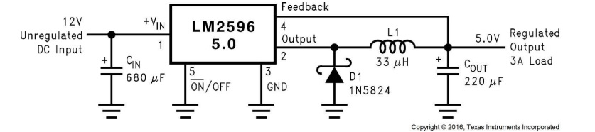

ltspice-lm2596-buck-converter
=============================

[LM2596 data sheet, product information and support | TI.com](https://www.ti.com/product/LM2596)
[matthiasdittmer/diy_bench_power_supply_lm2596: A DIY two channel bench power supply based on Texas Instruments LM2596](https://github.com/matthiasdittmer/diy_bench_power_supply_lm2596)
- [diy_power_supply_lm2596 - EasyEDA open source hardware lab](https://oshwlab.com/matthiasdittmer/diy_power_supply_lm2596)
